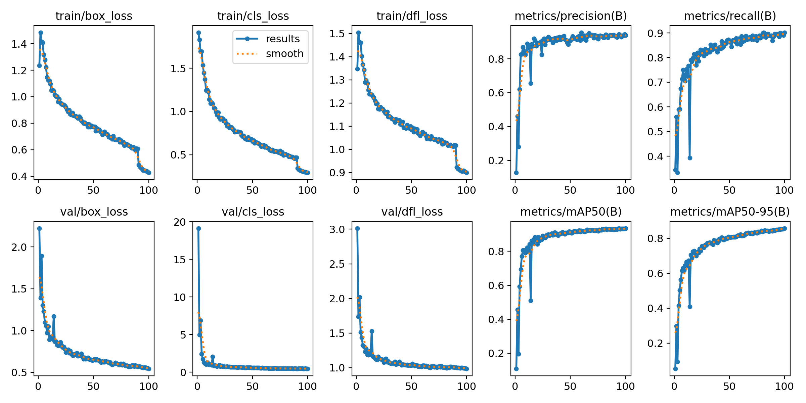
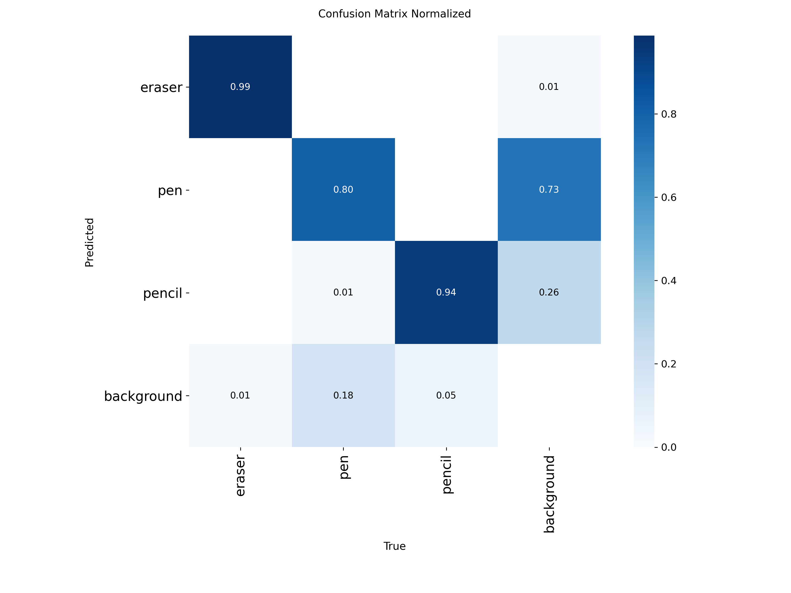

# 🖊️ Pen and Pencil Detection with YOLOv8

Detecting and classifying **pen vs pencil** objects using YOLOv8.  
This project includes dataset preparation, training, evaluation, and inference (image & video).

## 🔍 Example Results
[https://github.com/CTNone/detect_pen_pencil/raw/main/TEST/result_video.mp4](https://drive.google.com/file/d/1ll1VXfucf3t22wyfRQPuBoRju7RmdgDJ/view?usp=drive_link)

## 📂 Dataset
- Source: [Roboflow Pen and Pencil Dataset](https://app.roboflow.com/objdetecpen)  
- Format: YOLOv8 (train/valid/test split).

## 🚀 Features

- ✅ **High Accuracy**: Detects pens and pencils with precision
- ✅ **Real-time Processing**: Works with live video feeds
- ✅ **Image Support**: Processes single images and batches
- ✅ **Easy Integration**: Simple API for implementation
- ✅ **Custom Training**: Train on your own dataset

## 📈 Results
- Mô hình được train hơn 4200 image được tổng hợp từ Roboflow
- Mô hình được tran on T100 kaggle 
- Đạt được  mAP50 = 0.935 và mAP50-95 = 0.857
  

### Performance Metrics

## 🙏 Acknowledgements
- [Ultralytics YOLOv8](https://github.com/ultralytics/ultralytics)
- [Roboflow](https://roboflow.com) for dataset hosting

## 👥 Authors
[CTNone](https://github.com/CTNone)

