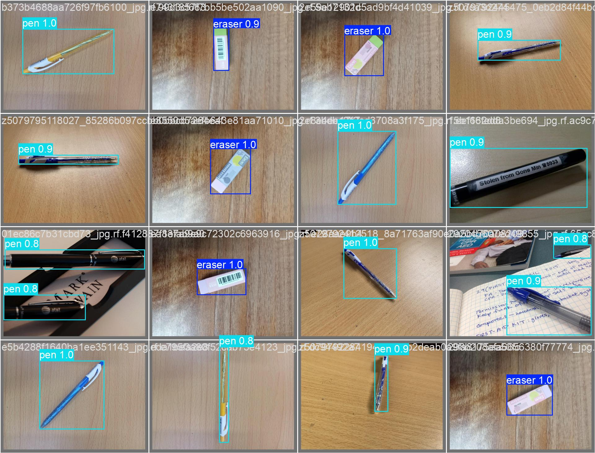

# 🖊️ Pen and Pencil Detection Project

A deep learning-based object detection system for identifying pens and pencils in images and videos.



*Thay thế bằng ảnh demo của bạn*
## 📋 Project Overview

This project implements an object detection model to recognize and locate pens and pencils in various environments. The system can process both images and real-time video streams.

## 🚀 Features

- ✅ **High Accuracy**: Detects pens and pencils with precision
- ✅ **Real-time Processing**: Works with live video feeds
- ✅ **Image Support**: Processes single images and batches
- ✅ **Easy Integration**: Simple API for implementation
- ✅ **Custom Training**: Train on your own dataset
### Detection Result Video
[https://github.com/CTNone/detect_pen_pencil/raw/main/TEST/result_video.mp4](https://drive.google.com/file/d/1ll1VXfucf3t22wyfRQPuBoRju7RmdgDJ/view?usp=drive_link)
## 🛠️ Installation

### Prerequisites
```bash
Python 3.7+
TensorFlow 2.x
OpenCV
Other dependencies...
